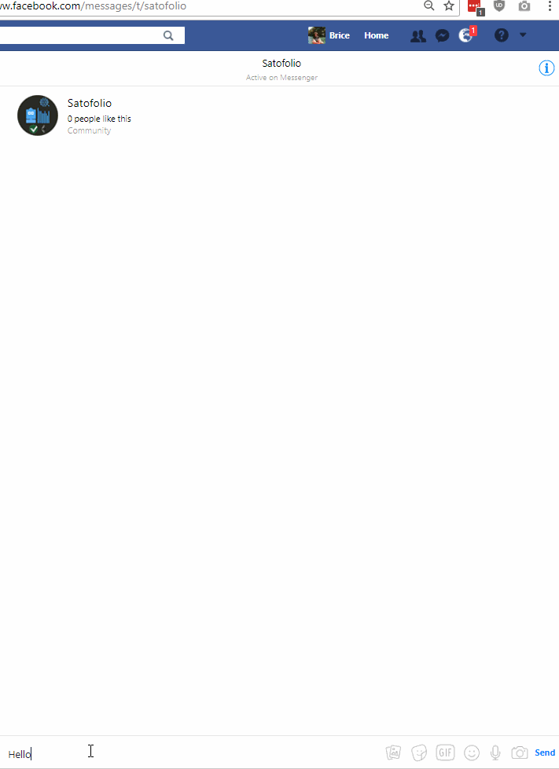

  

| [Demo](#demo) | [Requirements](#requirements) | [Talk to Sato on Messenger](#sato-on-messenger) | [Documentation](#documentation) | [Changelog](#changelog) |
|---|---|---|---|---|

# SATO IS A WORK IN PROGRESS

### WHAT IS SATO?

Sato is a chatbot able to answer generic questions about cryptocurrencies and fetch any currency price.

### SCOPE

1.  Crypto currency prices: Sato recognizes cryptocurrencies symbol ("ETH", "BTC") and fetch their price on [cryptocompare API](https://www.cryptocompare.com/api/) to finally return BTC, USD, and EUR value to the user.
2.  Questions about wallets: online wallets, exchange wallets, cold wallets and hardware wallets.
3.  Questions about the keys: what's they are are and what's their use.
4.  Questions about specific cryptocurrencies (What is BTC?)
5.  Questions about exchanges and trading cryptocurrencies.

[You can find and fork Sato - BOT from here](https://recast.ai/ahirice/sato-cryptobot/train/?utm_source=github&utm_medium=referral&utm_campaign=sato)

## DEMO

  

### SATO ON MESSENGER

<a href="https://www.messenger.com/t/satofolio" target="_blank">

### REQUIREMENTS

Sato is a chatbot built on [Recast.AI](https://recast.ai?utm_source=github&utm_medium=referral&utm_campaign=sato). 

The server (used for API calls) is built with [Python 3.6](https://www.python.org/). It requires [Flask](http://flask.pocoo.org/) and [Requests](http://docs.python-requests.org/en/master/) to function.

### FILES

Two server files are included in the repo:

-   **server-self-run.py** (to use with ngrok): Use this script to test your bot locally (see Tutorial 1).
-   **server.py** (to use with Heroku): Use this script if you want to host it on a server, using Heroku for instance (see Tutorial 2).

### DOCUMENTATION

The whole process of building Sato has been documented:

- [Tutorial #1 - Setting up a self-hosted server (ngrok) to let our bot fetch data (crypto prices) from third party APIs.](https://recast.ai/blog/python-cryptobot/)
- [Tutorial #2 - Hosting your server on Heroku using Github](https://recast.ai/blog/github-repo-heroku/)
- [Tutorial #0 - The basics of bot building with Recast.AI](https://recast.ai/blog/build-your-first-bot-with-recast-ai/)

## CHANGELOG
- **12/22 - Persistent Menu**: Add a persistent menu to Sato with three quick links.
- **12/13 - Exchanges**: Sato is now able to process queries regarding exchages and purchasing cryptos.
- **12/06 - Quick Replies**: All of Sato's Quick Replies are now regrouped in the "qr" skill. Added emojis and revised the conversation flow.
