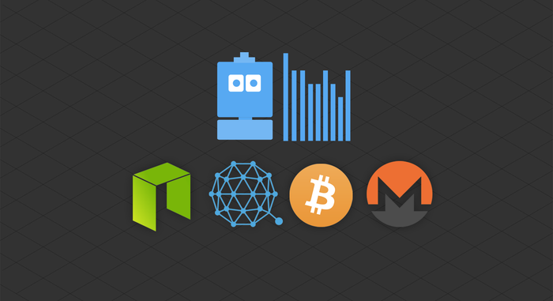

  

[You can find and fork Sato - BOT from here](https://recast.ai/ahirice/sato-cryptobot/train/?utm_source=github&utm_medium=referral&utm_campaign=sato)

### WHAT IS SATO?

# SATO IS A WORK IN PROGRESS

### SCOPE

1.  Crypto currency prices: Sato recognizes cryptocurrencies symbol ("ETH", "BTC") and fetch their price on [cryptocompare API](https://www.cryptocompare.com/api/) to finally return BTC and USD value to the user.
2.  Questions about wallets: online wallets, exchange wallets, cold wallets and hardware wallets.
3.  Questions about the keys: what's they are are and what's their use.

### REQUIREMENTS

Sato is a chatbot built on [Recast.AI](https://recast.ai?utm_source=github&utm_medium=referral&utm_campaign=sato). 

The server (used for API calls) is built with [Python 3.6](https://www.python.org/). It requires [Flask](http://flask.pocoo.org/) and [Requests](http://docs.python-requests.org/en/master/) to function.

### FILES

Two server files are included in the repo:

-   **server.py**: Use this script if you want to host it on a server, using Heroku for instance.
-   **server-self-run.py**: Use this script to test your bot locally

### DOCUMENTATION

The whole process of building Sato has been document and will be published soon.

[Tutorial #1 - Setting up a self-hosted server (ngrok) to let our bot fetch data (crypto prices) from third party APIs.](https://recast.ai/blog/python-cryptobot/)
